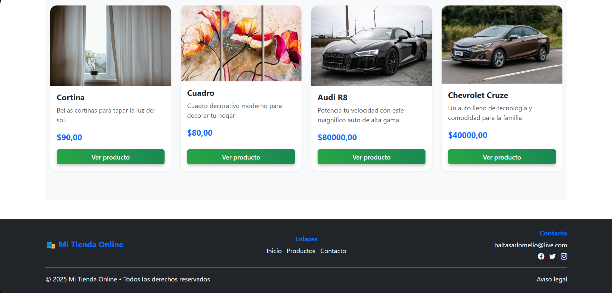
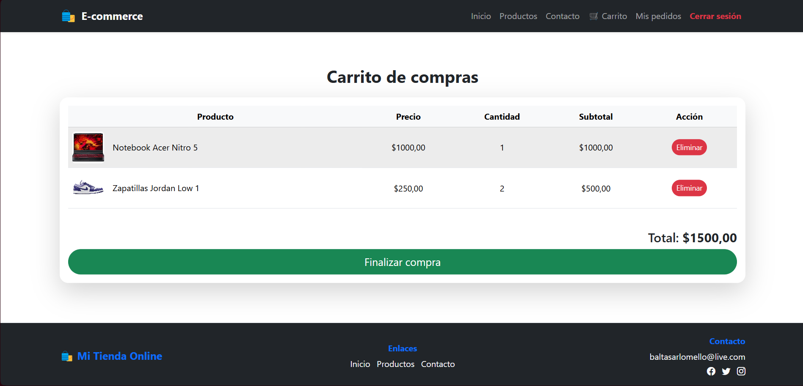
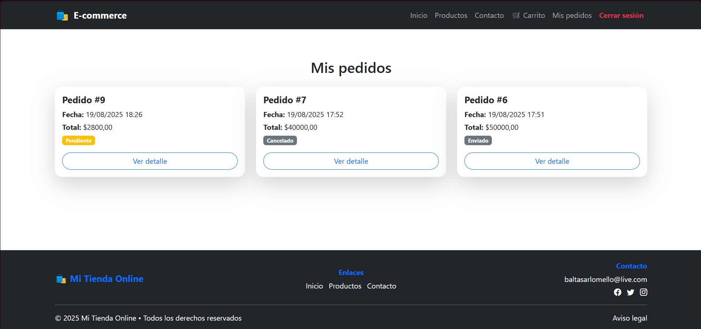
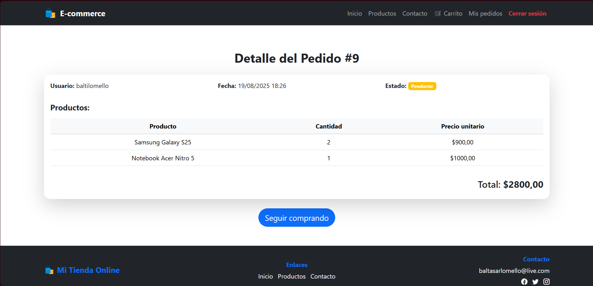

# Tienda Online - Proyecto Django

  

---

## 📌 Descripción

Este es un sistema **E-commerce** desarrollado con **Django** para la compra de productos. Permite a los usuarios registrarse, navegar productos, agregarlos al carrito y generar pedidos.  

> ⚠️ Actualmente, el proyecto permite generar pedidos, pero **no se puede realizar el pago online**.

---

## ✨ Funcionalidades

- Registro y autenticación de usuarios (login/logout).  
- Navegación de productos por categorías.  
- Gestión de carrito de compras:
  - Agregar productos.
  - Modificar cantidad.
  - Eliminar productos.  
- Generación de pedidos a partir del carrito.  
- Visualización de pedidos realizados: 
  - Detalles de cada pedido (productos, cantidades, subtotales y total).  
- Interfaz responsive con **Bootstrap 5**.  
- Mensajes y alertas para acciones de usuario (agregado al carrito, pedido generado, etc.).  
- Footer y header dinámicos según el estado de autenticación del usuario.  

---

## 🖼️ Capturas de pantalla

### Header y navegación


### Footer


### Lista de productos


### Categorias


### Carrito de compras


### Lista de pedidos


### Detalle de pedido


---

## 🚀 Instalación

1. Clonar el repositorio:
    ```bash
    git clone https://github.com/tuusuario/Proyecto_Ecommerce_Django.git
    cd Proyecto_Ecommerce_Django
    ```

2. Crear y activar entorno virtual:
    ```bash
    python -m venv env
    source env/bin/activate  # Linux/macOS
    env\Scripts\activate     # Windows
    ```

3. Instalar dependencias:
    ```bash
    pip install -r requirements.txt
    ```

4. Configurar variables de entorno (opcional, como `SECRET_KEY`, `DEBUG`, `DATABASE_URL`).  

5. Aplicar migraciones:
    ```bash
    python manage.py migrate
    ```

6. Crear superusuario (opcional, para acceder al panel de administración):
    ```bash
    python manage.py createsuperuser
    ```

7. Ejecutar el servidor:
    ```bash
    python manage.py runserver
    ```

8. Abrir en el navegador: [http://localhost:8000](http://localhost:8000)

---

## 🖥️ Uso

1. Registrarse o iniciar sesión.  
2. Explorar los productos disponibles.  
3. Agregar productos al carrito y ajustar cantidades.  
4. Generar un pedido desde el carrito.  
5. Consultar el historial de pedidos y sus detalles.  
6. Administrar productos, categorías y pedidos desde Django Admin (si eres superusuario).  

---

## 🛠️ Tecnologías

- **Python 3.12**  
- **Django 5.x**  
- **Bootstrap 5**  
- **SQLite** (por defecto, se puede cambiar a PostgreSQL, MySQL, etc.)  

---

## 👨‍💻 Autor

**Lomello Baltasar** – [baltasarlomello@live.com](mailto:baltasarlomello@live.com)  

Sígueme en [GitHub](https://github.com/Balti2003)

---

¡Gracias por visitar el proyecto! 🚀
